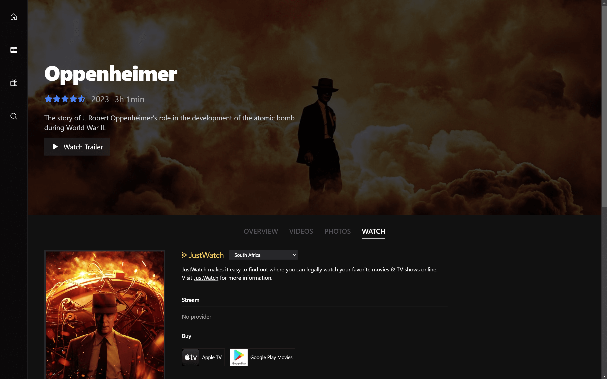

# Preview Vault App

> The Preview Vault App allows users to search and preview tons of the latest Movies and TV Series online using Next.js and Typescript.




## Installation

### Setup

Clone the source locally:

```sh
$ git clone https://github.com/thepembeweb/preview-vault.git
$ cd preview-vault
```

Install project dependencies:

```sh
$ npm install
```

Obtain keys for the below API:

- [TMDB](https://developers.themoviedb.org/3) - The Movie Database API used

Create a new `.env.local` file and add the following environment variables for the following API:

```sh
TMDB_API_KEY=**************************
```

Start the client app:

```sh
$ npm run dev
```

Alternatively, you can view the live website [here](https://preview-vault.vercel.app/).

## Built With

- [Next.js 13](https://nextjs.org/) - The web framework used
- [TailwindCSS](https://tailwindcss.com/) - The css framework used
- [The Movie Database API](https://www.themoviedb.org/) - The api used
- [Typescript](https://github.com/microsoft/TypeScript) - The language used

## Authors

- **[Pemberai Sweto](https://github.com/thepembeweb)** - _Initial work_ - [Preview Vault App](https://github.com/thepembeweb/preview-vault)

## License

[](http://badges.mit-license.org)

- This project is licensed under the MIT License - see the [LICENSE.md](LICENSE.md) file for details
- Copyright 2023 © [Pemberai Sweto](https://github.com/thepembeweb).
